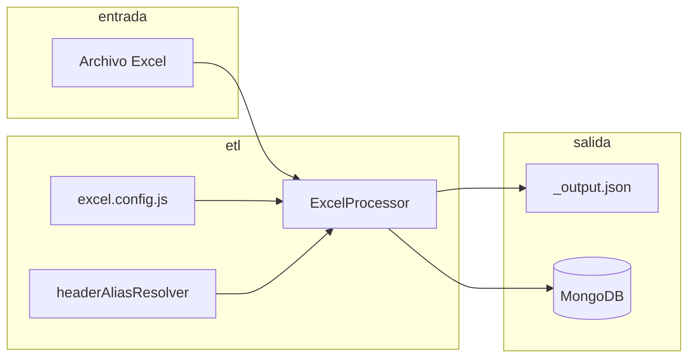
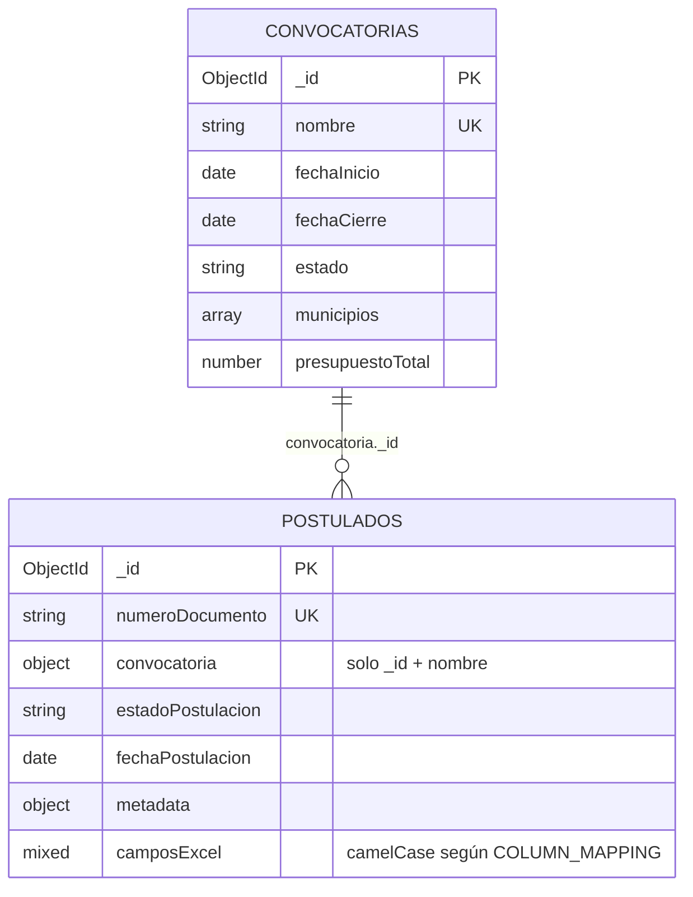

# Arquitectura de datos (actual)

Este documento describe cómo fluyen y se persisten los datos del programa de **mejoramiento de vivienda**: desde el Excel hasta MongoDB, y el modelo lógico entre **convocatorias** y **postulados**.

---

## 1. Visión general

| Capa | Responsabilidad |
|------|------------------|
| **Configuración Excel** | `src/config/excel.config.js`: columnas esperadas, mapeo a campos JSON, validaciones, lotes, logging. |
| **Aliases de encabezado** | `src/utils/headerAliasResolver.js`: normaliza nombres de columnas con errores de tipeo y los lleva al nombre canónico antes de validar y mapear. Opcional: `HEADER_ALIASES` en `excel.config.js`. |
| **Procesamiento** | `ExcelProcessor` → `SheetValidator` + `JsonTransformer`: Excel → array de objetos planos (camelCase) + `_metadata` por fila. |
| **Persistencia** | Mongoose: colección de convocatorias y colección de postulados; conexión vía `src/model/connection.js`. |

---

## 2. MongoDB: conexión y base de datos

- **Conexión:** `mongoose.connect(MONGODB_URL)` en `src/model/connection.js`.
- **Base de datos y host:** los define la URL en la variable de entorno **`MONGODB_URL`** (incluye nombre de base si aplica, p. ej. `mongodb://host:27017/nombre-bd`).
- No hay colecciones embebidas en la URL; las colecciones físicas las fija cada modelo con la opción `collection` del schema.

---

## 3. Colecciones y modelos

### 3.1 Convocatorias (`convocatorias-mejoramiento`)

**Modelo:** `Convocatoria` (`ConvocatoriaMejoramiento` en Mongoose).

Documento **maestro** del ciclo de convocatoria:

| Campo (lógico) | Uso |
|----------------|-----|
| `nombre` | Único, identificador humano de la convocatoria. |
| `fechaInicio`, `fechaCierre` | Ventana temporal. |
| `estado` | Ciclo de vida (`BORRADOR`, `ABIERTA`, `CERRADA`, etc.). |
| `municipios` | Lista de strings (ámbito geográfico declarado). |
| `presupuestoTotal` | Monto referencial. |
| `createdAt`, `updatedAt` | Timestamps automáticos. |

No se guardan aquí los postulados en array: la relación hacia postulados es **por referencia** desde el otro lado.

---

### 3.2 Postulados / beneficiarios (`postulados-mejoramiento`)

**Modelo:** `BeneficiarioMejoramiento` (en scripts de importación directa a veces importado como `Postulado`).

- Un **documento** = una persona (fila de matriz) con campos en **camelCase** alineados con `COLUMN_MAPPING` en `excel.config.js` (subregión, municipio, nombres, documento, viabilidad, subsidios, etc.).
- **`numeroDocumento`**: obligatorio y **único en toda la colección** (una sola ficha por número de documento a nivel global).

#### Convocatoria embebida (solo referencia ligera)

El subdocumento `convocatoria` guarda únicamente:

- **`_id`**: `ObjectId` de la convocatoria en `convocatorias-mejoramiento` (`ref: 'ConvocatoriaMejoramiento'`).
- **`nombre`**: copia desnormalizada para listados sin hacer `populate`.

No se duplican fechas, estado ni presupuesto de la convocatoria en cada postulado.

#### Estado de postulación

- `estadoPostulacion` (por defecto `REGISTRADO`).
- `fechaPostulacion`.

#### Metadatos de proceso (`metadata`)

Incluye, según el flujo: `archivoOrigen`, `hojaOrigen`, `filaOrigen`, `fechaProcesamiento`, `fechaImportacion`, `versionAlgoritmo`, etc. El Excel intermedio puede aportar trazas vía `_metadata` en JSON, que el script de importación puede volcar a campos de `metadata`.

#### Timestamps

`createdAt` y `updatedAt` automáticos en ambos modelos.

---

## 4. Relación entre entidades

- **Lectura por convocatoria:** consultas filtran por `convocatoria._id` (métodos estáticos en el modelo de postulado).
- **Actualización de la convocatoria en el catálogo:** no actualiza automáticamente el `nombre` embebido en postulados viejos; un nuevo import con `updateOne` puede refrescar el subdocumento según el script.

---

## 5. Flujos de carga de datos

### 5.1 Solo Excel → JSON

- **Entrada:** `node src/index.js <ruta.xlsx>`
- **Salida:** junto al Excel, `*_output.json` (array de documentos) y `*_report.json` (reporte de proceso).
- Los objetos pueden incluir **`_metadata`** (`sourceSheet`, `sourceRow`, `processedAt`).

### 5.2 Excel → MongoDB (recomendado para operación)

- **Script:** `src/importarExcelAMongo.js`
- **Pasos:** procesar Excel con la misma config → escribir `*_output.json` → conectar Mongo → obtener o crear `Convocatoria` (`--convocatoria=` o `--nombre=` o nombre por defecto del script) → `updateOne` por `numeroDocumento` con **upsert**, asignando `convocatoria: { _id, nombre }`, `metadata` y estado de postulación.
- **Idempotencia / colisión:** mismo `numeroDocumento` **actualiza** el mismo documento; la última importación gana en campos sustituidos por `$set`.

### 5.3 JSON ya generado → MongoDB

- **Script:** `src/model/importarDatos.js` (p. ej. `pnpm db:import`)
- Lee un array JSON; opciones de limpiar colección, upsert por documento, lotes.

En este flujo **no** se asigna convocatoria salvo que el JSON ya traiga ese subdocumento y pase validación del schema.

---

## 6. Reglas de validación en Excel (config)

Definidas en `excel.config.js`:

- **`VALIDATIONS.required`:** columnas obligatorias en encabezado (tras resolver aliases).
- **`VALIDATIONS`:** únicos, email, fechas, numéricos según nombres de columna Excel canónicos.
- **`EXPECTED_COLUMNS`:** plantilla completa; pueden faltar columnas no obligatorias → **advertencia**, no error.
- **`COLUMN_MAPPING`:** nombre de columna Excel (canónico) → campo en documento JSON.

---

## 7. Índices destacados (postulados)

- `numeroDocumento` único.
- Índices por `municipio`, `subregion`, texto en `nombreCompleto` / `observaciones`, compuestos `municipio + numeroDocumento`, etc. (ver schema en código).

---

## 8. Archivos de auditoría

- **Log de proceso Excel:** ruta en `LOG_FILE_PATH` (por defecto `./logs/excel-processing.log`), formato línea: timestamp, nivel, mensaje, JSON opcional.

---

## 9. Referencia rápida de archivos

| Archivo | Rol |
|---------|-----|
| `src/config/excel.config.js` | Contrato de columnas y validaciones del Excel. |
| `src/utils/headerAliasResolver.js` | Sinónimos / typos de encabezados. |
| `src/model/Convocatoria.js` | Schema convocatorias. |
| `src/model/BeneficiarioMejoramiento.js` | Schema postulados. |
| `src/model/connection.js` | Conexión Mongoose. |
| `src/importarExcelAMongo.js` | Pipeline Excel + Mongo con convocatoria. |
| `src/model/importarDatos.js` | Importación desde JSON. |

---

*Documento alineado con el código del repositorio. Si cambian nombres de colección, campos o variables de entorno, actualizar este archivo en el mismo cambio.*
